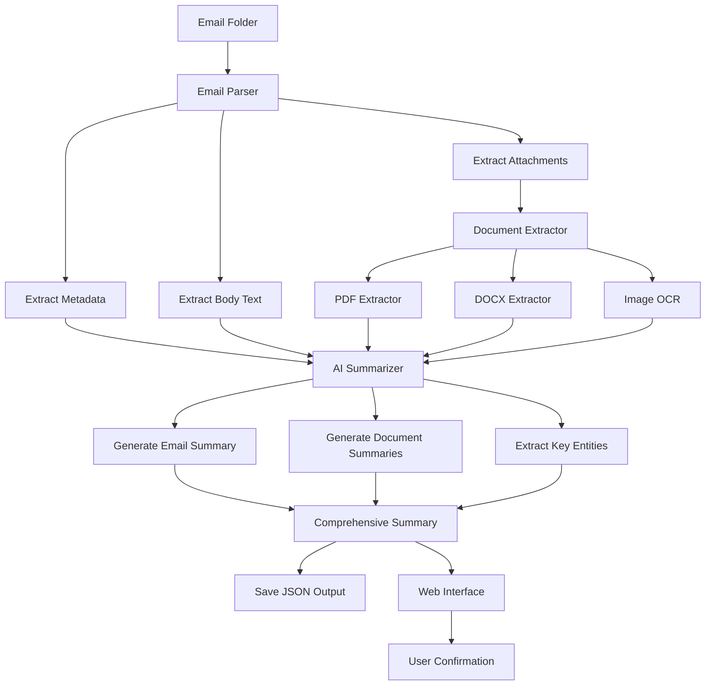

```mermaid
graph TD
    A[Email Folder] --> B[Email Parser]
    B --> C[Extract Metadata]
    B --> D[Extract Body Text]
    B --> E[Extract Attachments]
    
    E --> F[Document Extractor]
    F --> G[PDF Extractor]
    F --> H[DOCX Extractor]
    F --> I[Image OCR]
    
    C --> J[AI Summarizer]
    D --> J
    G --> J
    H --> J
    I --> J
    
    J --> K[Generate Email Summary]
    J --> L[Generate Document Summaries]
    J --> M[Extract Key Entities]
    
    K --> N[Comprehensive Summary]
    L --> N
    M --> N
    
    N --> O[Save JSON Output]
    N --> P[Web Interface]
    P --> Q[User Confirmation]
```
